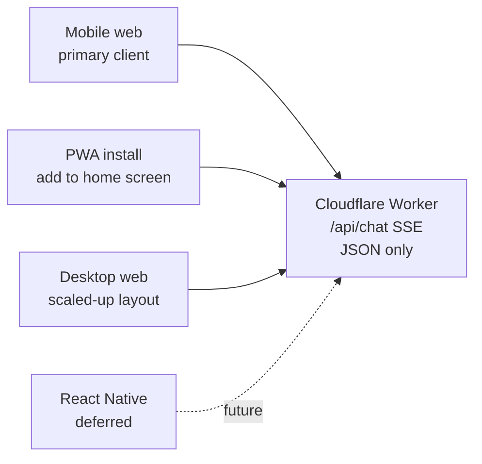
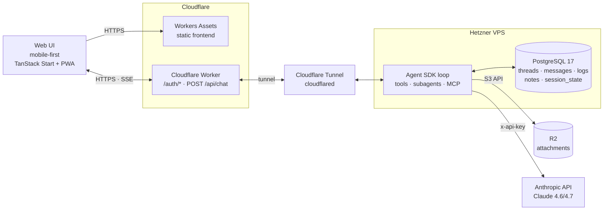
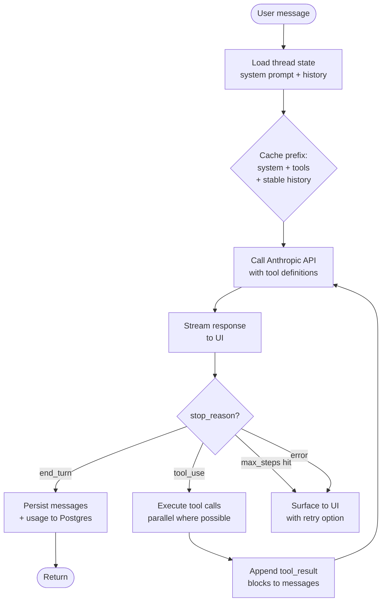
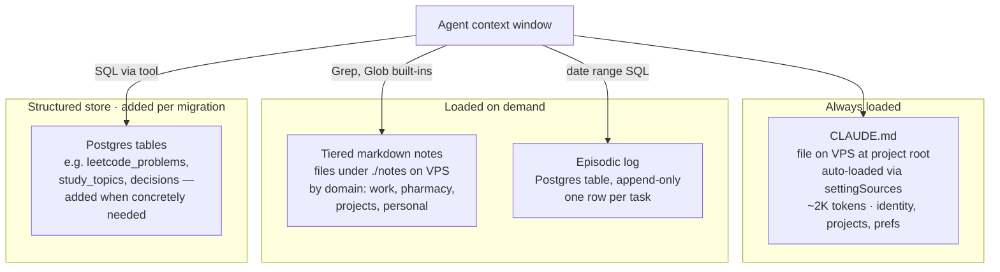
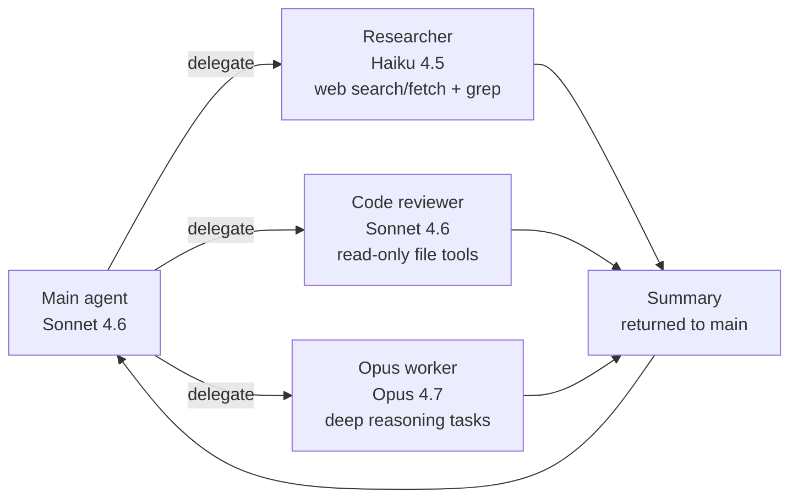
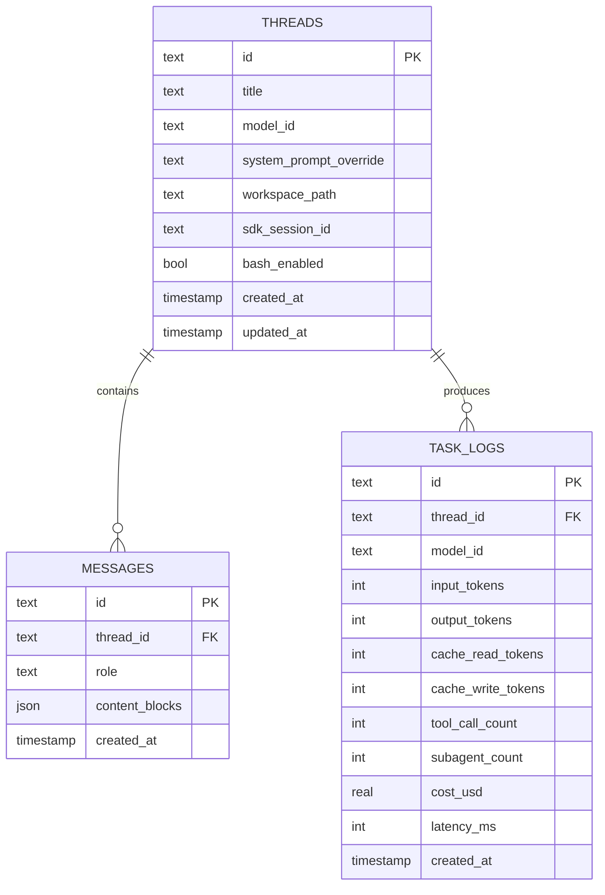

# Personal AI Agent — Spec

## Goal

A personal AI agent for daily use: chat, research, memory, tool use, and light automation. **Mobile-first web chat interface** with multiple threads. Built on the Anthropic Agent SDK, running on a Hetzner VPS fronted by Cloudflare (Worker + Tunnel). Single user (me). Possible React Native app down the line.

## Non-goals

- Multi-tenant. It's just me.
- Multi-model. Claude only, via Anthropic direct API.
- Telegram or any chat-platform bridge.
- Desktop-first layout. Desktop is a scaled-up version of the mobile design, not the reverse.

## Stack

- **Agent engine:** Anthropic Agent SDK (TypeScript), running on a Hetzner VPS (Node.js 24+).
- **Models:** Sonnet 4.6 default, Opus 4.7 for hard tasks, Haiku 4.5 for routing and cheap subagent work.
- **Inference:** Anthropic API (direct). Prompt caching is handled automatically by the SDK; 1-hour TTL via `ENABLE_PROMPT_CACHING_1H=1` in the SDK process env.
- **Backend:** Hetzner VPS hosts the agent loop and exposes `POST /api/chat` (request body carries the user message; response is `text/event-stream`). A Cloudflare Worker fronts auth, validates passkey sessions, and proxies the SSE stream to the VPS through a named Cloudflare Tunnel.
- **API key:** `ANTHROPIC_API_KEY` lives on the VPS in `/opt/agent/.env` (chmod 600, agent user only). The SDK calls Anthropic directly. Operational hardening: Anthropic Console spend cap on the key, VPS is Tailscale-only SSH + ufw default-deny + outbound-only tunnel.
- **Storage:** PostgreSQL 17 on the VPS — replaces D1 and KV. Workers KV holds passkey credentials (auth-only). R2 for file attachments only (accessed from the VPS via the S3-compatible API).
- **Frontend:** TanStack Start (probable) or Next.js, shadcn for components, designed mobile-first with PWA installability. Deploys as its own Worker on the catchall `chat.abdirahmanhaji.com/*` path.
- **Auth:** Passkey via SimpleWebAuthn, multi-user-ready KV schema (`users:`, `creds:`, `user_creds:`). Sessions issued by the Worker as stateless JWT-in-HttpOnly-cookie. Register endpoint gated by `REGISTRATION_CODE` Workers Secret (rotate to invite).
- **Secrets:** Worker holds `INTERNAL_WORKER_TO_VPS`, `SESSION_SIGNING_KEY`, `REGISTRATION_CODE` in Workers Secrets. VPS holds `ANTHROPIC_API_KEY` and `INTERNAL_WORKER_TO_VPS` (same value as Worker's) in `/opt/agent/.env`.

## Client strategy

The web app is the MLC client. It is built mobile-first and installable as a PWA — that gets me 90% of a native experience (home-screen icon, full-screen, offline shell, push notifications via web push) without the App Store tax.

Native React Native app is a deferred option, not a commitment. The architecture is set up so it stays cheap to add later: the Worker is a clean JSON/SSE API, all UI state lives client-side, no server-rendered HTML in the chat flow. If the PWA hits a real wall (background tasks, native voice input, share-sheet integration), Expo + React Native is the next step — and it can talk to the same Worker without changes.

## System architecture

## Agent loop

Step cap per task: 25. Logged and surfaced if hit.

## Memory layer

Mirrors the design from the earlier Telegram agent, but rehomed for the VPS architecture: filesystem layers stay on the VPS disk, the structured/episodic layers move to PostgreSQL.

**Why this shape:** root context is the cheap always-on layer that keeps the agent oriented. The Agent SDK auto-loads `CLAUDE.md` via `settingSources: ['project']` and prompt-caches it. Tiered notes are markdown files searched with the SDK's built-in `Grep`/`Glob` — fast and free of context until invoked. Episodic log lives in Postgres (`episodic_log`, append-only). Domain-specific structured tables (LeetCode progress, decisions log, study topics, etc.) get their own migration files when a real need surfaces — not pre-designed.

## Tool registry

Tools exposed to the main agent and subagents. Most are Agent SDK builtins listed in `ALLOWED_TOOLS` in `apps/agent/src/index.ts`; memory and DB ops are scripts under `apps/agent/bin/` invoked through `Bash`.

| Tool                    | Purpose                        | Notes                                                             |
| ----------------------- | ------------------------------ | ----------------------------------------------------------------- |
| `Read`, `Write`         | Workspace file ops             | Agent SDK builtin. cwd = `apps/agent/`                            |
| `Grep`, `Glob`          | Search the notes layer         | Agent SDK builtin                                                 |
| `WebSearch`             | External search                | Agent SDK builtin                                                 |
| `Bash`                  | Shell execution                | Agent SDK builtin. Used to invoke memory + DB scripts             |
| `Agent`                 | Delegate to subagent           | Agent SDK builtin. See Subagents section                          |
| `bin/memory-append.mjs` | Write to episodic log or notes | Invoked via `Bash`. `--mode episodic\|notes`                      |
| `bin/db-query.mjs`      | Read/write Postgres            | Invoked via `Bash`. Read-only by default; `--write` for mutations |

## Subagents

Rules:

- Subagents have their own context window — main agent never sees intermediate steps
- Subagents have their own scoped tool subset (researcher can't write files, reviewer can't run bash)
- Max nesting depth 2. Hard cap in code.
- Each subagent has its own system prompt, cached separately

**Hosting:** Subagents and MCP servers all run inside the same Agent SDK process on the VPS — no separate infrastructure. Subagents inherit the VPS's filesystem and Postgres connection but get scoped tool subsets. Subagents are defined as markdown files under `.claude/agents/` (currently `researcher.md` and `code-reviewer.md`). The SDK loads them automatically; each declares its own model, tools, and system prompt. MCP servers are configured per-thread or globally via the `mcpServers` option.

## Routing

**Automatic pre-query routing.** Before each `query()` call, a raw Haiku API call (~$0.0002, ~200ms) classifies the incoming query and returns `{tier: "haiku" | "sonnet" | "opus", reason: string}`. The orchestration layer in `index.ts` picks the model accordingly:

| Tier     | Model      | Use case                                                             |
| -------- | ---------- | -------------------------------------------------------------------- |
| `haiku`  | Haiku 4.5  | Lookups, summaries, classification, routine writes                   |
| `sonnet` | Sonnet 4.6 | Coding, reasoning, synthesis, most chat (default)                    |
| `opus`   | Opus 4.7   | Deep ambiguous reasoning, multi-step planning, high-stakes decisions |

The classifier is a raw `anthropic.messages.create()` call — not a subagent and not a system prompt instruction — so it runs before the agent loop starts and pays no prefix tax.

Budget: soft cap ~$50/mo but can flex for Opus on genuinely complex tasks (~$0.025/warm turn vs ~$0.005 for Sonnet).

The routing decision is displayed in the CLI as `[router: <tier> — <reason>]` before the agent response, and the classifier cost is folded into the per-turn cost line. Routing decisions are also persisted to `task_logs` for historical queries like "how often does it route to Opus."

## Threads and state

Messages stored as JSON content blocks (the Anthropic SDK's native format) so tool calls and tool results round-trip cleanly. No flattening to plain text.

**Dual storage of conversation state.** Two stores serve different purposes and don't overlap:

- **`MESSAGES` (Postgres)** — source of truth for the UI. The frontend reads this via REST endpoints on every thread load. Shape is optimized for display: clean role/content rows, paginatable, queryable.
- **Agent SDK transcripts (filesystem)** — the SDK writes its own JSONL transcripts to `~/.claude/projects/` on the VPS. The frontend never touches them. They exist solely so the SDK can reconstruct Claude's full context (compaction summaries, parent_tool_use_id linkages, internal events) when a thread resumes.

The link between the two is `THREADS.sdk_session_id`, captured from the `system:init` message on the first turn of a thread and passed to `query({ resume: sdk_session_id })` on subsequent turns. `cleanupPeriodDays` is set to `365` so SDK transcripts aren't auto-deleted while threads are still live.

## UI design — mobile-first

Mobile-first installable PWA, multi-thread chat with streaming responses. Desktop is a scaled-up variant of the same layout, not a different one.

Two mobile UX behaviors shape the product, not just the styling:

- **Resilient streaming.** Cellular drops and iOS Safari background-suspend kill SSE connections. The client resumes from the last-seen message ID on reconnect, and replays any messages the server persisted while the tab was backgrounded.
- **PWA app shell.** A service worker caches the app shell so the UI loads instantly even on flaky cell. Conversations themselves still require network.

## Observability

Per-task row in `task_logs` (schema above). Cost sheet on mobile, dashboard view on desktop:

- Weekly spend, broken down by model
- Cache hit ratio (read tokens / total input tokens) — the metric that tells me if my prompt structure is right
- Tool call success rate
- p50/p95 latency
- Subagent invocation count and cost share

Goal: cache hit ratio above 70% in steady state. If it's lower, the system prompt or tool definitions are churning more than they should.

## Deployment

- **Cloudflare Worker** hosts `/auth/*`, `POST /api/chat` (proxies SSE through the tunnel), and `GET /health`. Frontend deploys as a separate Worker on the catchall `/*` path (step 5).
- **Hetzner VPS** hosts: Node.js + Agent SDK HTTP service (managed by systemd), PostgreSQL 17, `cloudflared` running a named tunnel (outbound only), and `tailscaled` for admin SSH.
- D1 removed. **KV kept for passkey credentials only** (`WEBAUTHN_CREDS` namespace). **R2 kept** for attachments.
- Worker secrets: `INTERNAL_WORKER_TO_VPS`, `SESSION_SIGNING_KEY`, `REGISTRATION_CODE`. VPS env via systemd `EnvironmentFile`: `ANTHROPIC_API_KEY`, `INTERNAL_WORKER_TO_VPS`, `DATABASE_URL`.
- Custom domain via existing Cloudflare DNS.
- Single environment (prod). No staging — it's just me.
- `wrangler.toml` checked in for the Worker. VPS deployed via SSH-over-Tailscale + `git pull` + service restart.
- Service worker registered for PWA, manifest with home-screen icon.
- See **vps-setup.md** for the full VPS provisioning runbook.

## Privacy posture

- Anthropic API key lives only in `/opt/agent/.env` on the VPS (chmod 600, agent user). Never in the frontend bundle, never in Workers Secrets. Operational defense: Anthropic Console spend cap caps the dollar damage if the key ever leaks.
- VPS has no public ports. Cloudflare Tunnel is outbound-only; SSH is Tailscale-only (no public port 22). `ufw` denies all inbound except the `tailscale0` interface.
- Anthropic's default no-training-on-API-data policy is the privacy floor; acceptable for a single-user personal agent.
- Persistent data lives in PostgreSQL on the VPS (full-disk encryption) and in R2 in my Cloudflare account.
- Passkey auth means no shared credentials anywhere.
- Workspace paths sandboxed per thread so a malicious tool result can't escape.

## Build order

1. **Agent loop + 4 core tools** — bare SDK, `Read`/`Write`/`Grep`/`WebSearch`, CLI harness for fast iteration.
2. **Memory layer** — root context (`apps/agent/CLAUDE.md`), tiered notes (`apps/agent/notes/<domain>/*.md`), episodic log (Postgres `episodic_log` table). Domain-specific structured tables added per migration as concrete needs arise.
3. **VPS deployment** — Hetzner CX22, Tailscale-only admin, `ufw` default-deny, systemd, Cloudflare Tunnel. See `vps-setup.md` for the runbook.
4. **Cloudflare Worker + VPS HTTP wrapper** — combined step. Backend Worker (`apps/worker/`) on `chat.abdirahmanhaji.com/{auth,api,health}/*` (passkey sessions, `POST /api/chat` SSE proxy) AND a real `apps/agent/src/server.ts` HTTP service running on the VPS that wraps SDK `query()` and streams events as SSE through the existing `agent.abdirahmanhaji.com` tunnel. No more `hello.mjs` placeholder. SDK calls Anthropic directly with the key from `/opt/agent/.env`.
5. **Mobile web UI** — threads, streaming, composer, drawer, settings sheet. Tested on actual iPhone before desktop is even styled. TanStack Start as a separate Worker (Vite-built, `main: "@tanstack/react-start/server-entry"`) on the catchall `chat.abdirahmanhaji.com/*` path. Adds `THREADS`/`MESSAGES` tables + `sdk_session_id` resumption when the multi-turn UI lands.
6. **PWA + auth** — service worker, manifest, passkey login via SimpleWebAuthn (wires UI to step 4's `/auth/*` endpoints).
7. **Observability** — `task_logs` writes + cost sheet (weekly spend by model, cache hit ratio, tool call success rate, p50/p95 latency, subagent count/cost).
8. **Subagents + smart routing** — researcher (Haiku 4.5, web search/fetch + grep), code-reviewer (Sonnet 4.6, read-only file tools), and opus-worker (Opus 4.7, deep reasoning). Pre-query Haiku classifier in `index.ts` routes to the right model before `query()` is called.
9. **MCP integration** — calendar, GitHub, others as use cases arise.

**MLC = steps 1–8.** Step 9 (MCP) lands organically as use cases arise. Ship MLC, dogfood on phone, iterate based on what actually annoys me.

## Spec drift log

Tracks places where the implementation deliberately diverges from the spec. Each line: what changed, when, why.

- **2026-04 — Postgres 16 → 17.** PG 17 was the current LTS at VPS provisioning time. Same migration files apply.
- **2026-04 — `wrangler.toml` → `wrangler.jsonc`.** Current Cloudflare best practice (newer features are JSON-only). Spec line 249 still references `.toml`.
- **2026-04 — Workers Assets → separate web Worker.** TanStack Start ships as its own Worker (not static assets). Backend Worker (step 4) and web Worker (step 5) co-exist on `chat.abdirahmanhaji.com` with path-scoped routes; CF resolves the more-specific routes (`/auth/*`, `/api/*`, `/health`) to the backend Worker first and falls through to the web Worker's catchall.
- **2026-04 — Public Worker hostname is `chat.abdirahmanhaji.com`.** The existing `agent.abdirahmanhaji.com` tunnel hostname stays as the Worker's private upstream (publicly reachable but secured by VPS-side `INTERNAL_WORKER_TO_VPS` validation).
- **2026-04 — Passkey credentials live in Workers KV** (`WEBAUTHN_CREDS` namespace). KV for auth is a separate concern from the "no KV" stack note (which referred to app storage). Schema is multi-user-ready from day one.
- **2026-04 — `/v1/*` Anthropic API proxy removed.** Original spec routed Anthropic calls through the Worker so the API key never lived on the VPS. The Agent SDK doesn't expose custom-header injection, making the proxy integration brittle. For a hardened single-user VPS with a spend-capped key, the operational complexity exceeded the security gain. VPS now holds `ANTHROPIC_API_KEY` directly; Worker no longer has `/v1/*` route, `INTERNAL_VPS_TO_WORKER`, or `ANTHROPIC_API_KEY` secret. Revisit if multi-user or compliance requires it.
- **2026-05-02 — Step 5b SPA built as TanStack Start in SPA mode (not plain Vite + React).** Scaffolded via `create-tanstack-app --cloudflare`, briefly went all-in on SSR, then pivoted to `tanstackStart({ spa: { enabled: true, prerender: { outputPath: '/index.html' } } })`. Dropped `@cloudflare/vite-plugin` (only needed for SSR runtime sim). Deploys as Workers Assets-only on `chat.abdirahmanhaji.com/*` catchall, no `main`. Get the file-based routing + devtools + Tailwind v4 wiring + vitest harness for free; pay no per-request Worker cost since no JS executes on the edge. Auth gate is client-side (`beforeLoad` with `pendingComponent`), brief loading state instead of server 302. Reversible — flipping `spa.enabled: false` restores SSR.
- **2026-05-02 — Local web dev port :3000 → :5173.** Agent HTTP server owns :3000 (VPS systemd + cloudflared baked in); changing it would mean updating prod infra. Web moved to Vite default :5173 instead.

## Open questions

- **TanStack Start vs Next.js** — pick after a 1-day spike on each, weighted toward whichever has cleaner SSE + mobile keyboard handling on Workers.
- **Voice input** — Web Speech API works on iOS Safari. Bolt on to the composer once the rest is stable.
- **React Native trigger** — what would actually push me to build a native app? Likely candidates: background sync, native voice/dictation quality, share-sheet integration ("share to agent" from any app), better push notifications. None of these block shipping.
- **Cloudflare Sandboxes for agent runtime** — considered, rejected. The VPS already consolidates D1 and KV into one Postgres (see Stack). The SDK's `~/.claude/projects/` JSONL transcripts (see Threads and state) need persistent disk for session resumption; Sandbox disks are ephemeral, so resumption would require dump/restore to R2 on every sleep/wake. Always-warm is free on the VPS but on Sandboxes requires `keepAlive: true` plus engineering for host-restart eviction. Revisit only if VPS ops become painful or burst/multi-tenant workloads enter scope.
