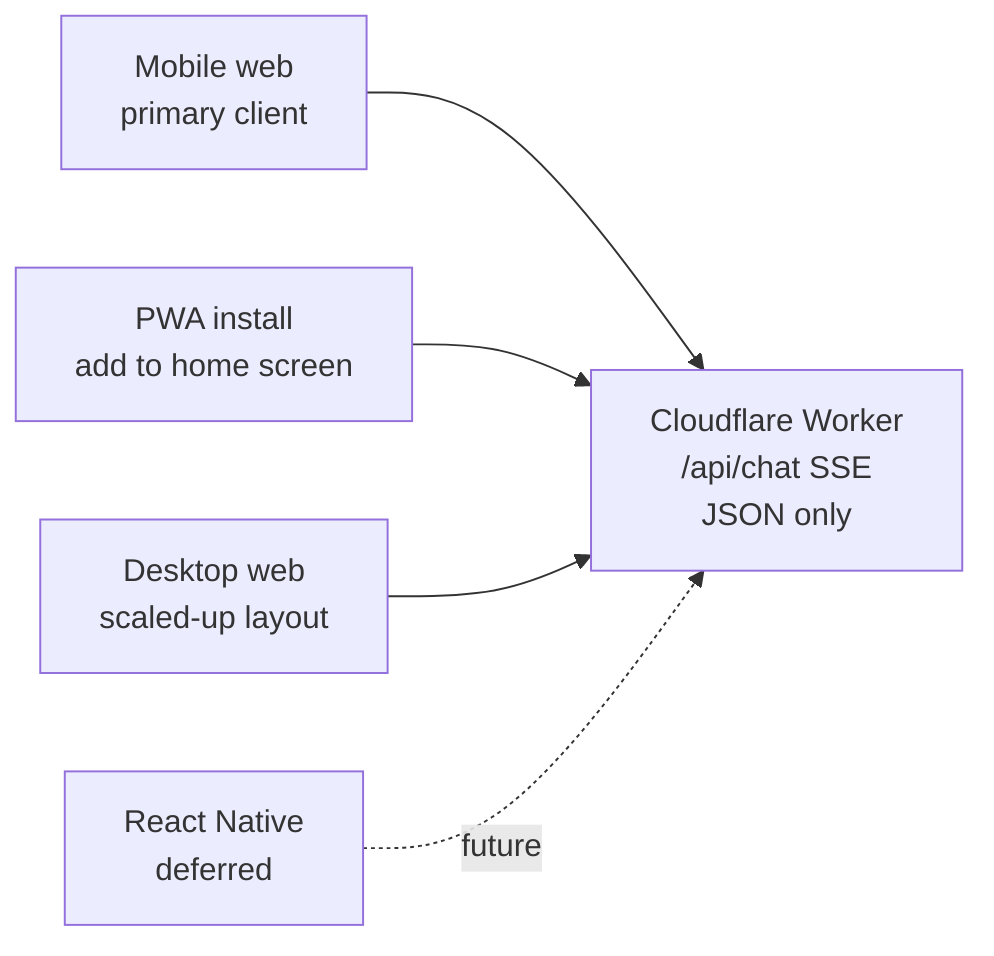
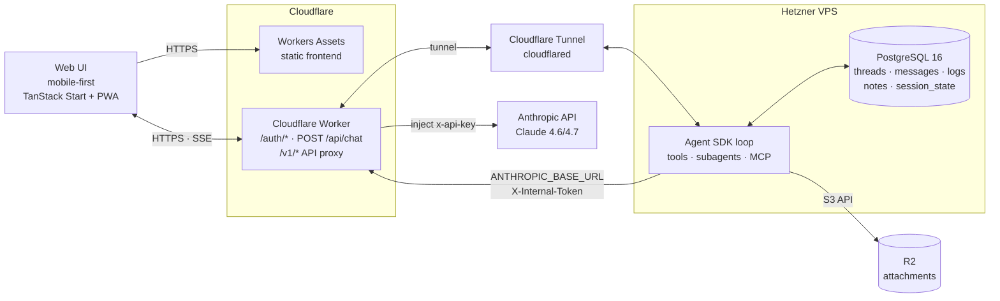
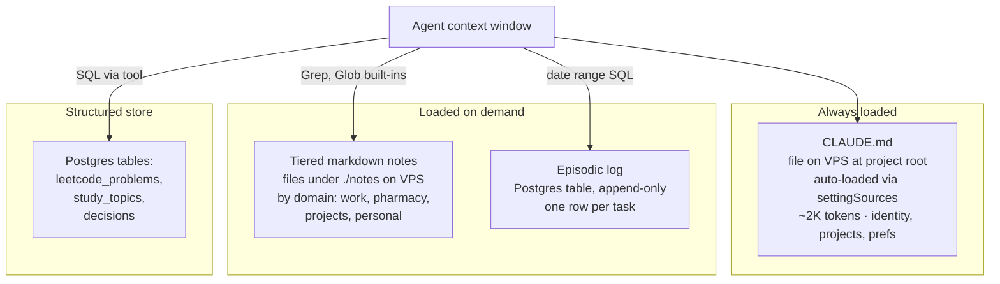
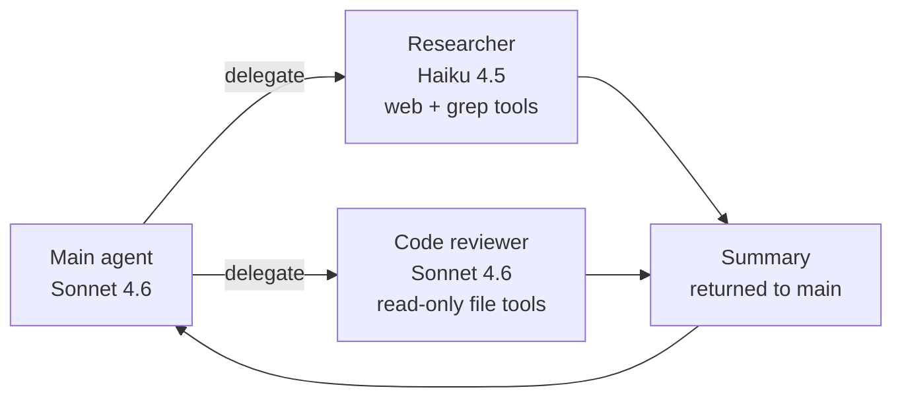
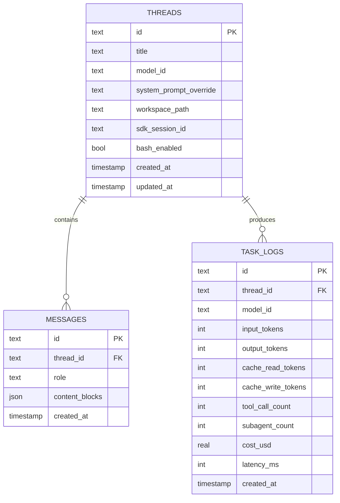

# Personal AI Agent — Spec

## Goal

A personal AI agent for daily use: chat, research, memory, tool use, and light automation. **Mobile-first web chat interface** with multiple threads. Built on the Anthropic Agent SDK, running on a Hetzner VPS fronted by Cloudflare (Worker + Tunnel). Single user (me). Possible React Native app down the line.

## Non-goals

- Multi-tenant. It's just me.
- Multi-model. Claude only, via Anthropic direct API.
- Telegram or any chat-platform bridge.
- Desktop-first layout. Desktop is a scaled-up version of the mobile design, not the reverse.

## Stack

- **Agent engine:** Anthropic Agent SDK (TypeScript), running on a Hetzner VPS (Node.js 18+).
- **Models:** Sonnet 4.6 default, Opus 4.7 for hard tasks, Haiku 4.5 for routing and cheap subagent work.
- **Inference:** Anthropic API (direct). Prompt caching is handled automatically by the SDK; 1-hour TTL via `ENABLE_PROMPT_CACHING_1H=1` in the SDK process env.
- **Backend:** Hetzner VPS hosts the agent loop and exposes `POST /api/chat` (request body carries the user message; response is `text/event-stream`). A Cloudflare Worker fronts auth, validates passkey sessions, and proxies the SSE stream to the VPS through a named Cloudflare Tunnel.
- **API key isolation:** The Worker also exposes `/v1/*`, which proxies to `https://api.anthropic.com/v1/*`. The Agent SDK on the VPS sets `ANTHROPIC_BASE_URL` to point at the Worker. The VPS sends an `X-Internal-Token` header (Workers Secret); the Worker validates it and injects the real `x-api-key` from Workers Secrets before forwarding. The VPS never stores the Anthropic key.
- **Storage:** PostgreSQL 16 on the VPS — replaces D1 and KV. R2 for file attachments only (accessed from the VPS via the S3-compatible API).
- **Frontend:** TanStack Start (probable) or Next.js, shadcn for components, designed mobile-first with PWA installability. Static assets served from Cloudflare Workers Assets at the edge.
- **Auth:** Passkey via SimpleWebAuthn, single user. Sessions issued by the Worker and validated on every request before proxying to the VPS.
- **Secrets:** `ANTHROPIC_API_KEY` and `INTERNAL_TOKEN` in Workers Secrets. VPS-side secrets via systemd `EnvironmentFile` (chmod 600, dedicated app user).

## Client strategy

The web app is the MLC client. It is built mobile-first and installable as a PWA — that gets me 90% of a native experience (home-screen icon, full-screen, offline shell, push notifications via web push) without the App Store tax.

Native React Native app is a deferred option, not a commitment. The architecture is set up so it stays cheap to add later: the Worker is a clean JSON/SSE API, all UI state lives client-side, no server-rendered HTML in the chat flow. If the PWA hits a real wall (background tasks, native voice input, share-sheet integration), Expo + React Native is the next step — and it can talk to the same Worker without changes.

## System architecture

## Agent loop

Step cap per task: 25. Logged and surfaced if hit.

## Memory layer

Mirrors the design from the earlier Telegram agent, but rehomed for the VPS architecture: filesystem layers stay on the VPS disk, the structured/episodic layers move to PostgreSQL.

**Why this shape:** root context is the cheap always-on layer that keeps the agent oriented. The Agent SDK auto-loads `CLAUDE.md` via `settingSources: ['project']` and prompt-caches it. Tiered notes are markdown files searched with the SDK's built-in `Grep`/`Glob` — fast and free of context until invoked. Episodic log and structured records benefit from rows (date ranges, decisions log, LeetCode progress).

## Tool registry

Day-one tools, all defined once and exposed to the main agent and subagents:

| Tool                      | Purpose                        | Notes                                   |
| ------------------------- | ------------------------------ | --------------------------------------- |
| `read_file`, `write_file` | Workspace file ops             | Sandboxed to the thread's workspace dir |
| `grep`, `glob`            | Search the notes layer         | Returns paths + line excerpts           |
| `web_search`              | External search                | Bing or Brave API                       |
| `web_fetch`               | Read a URL                     | Strips boilerplate, returns markdown    |
| `memory_append`           | Write to episodic log or notes | Single tool, mode arg                   |
| `sqlite_query`            | Read/write structured records  | Read-only by default, write-mode opt-in |
| `bash`                    | Gated shell execution          | Off by default per thread, toggle in UI |
| `delegate_to_subagent`    | Fan out to specialist          | Returns summary only                    |

MCP servers added later as needed (calendar, GitHub, Helius internal stuff if I ever want it).

## Subagents

Rules:

- Subagents have their own context window — main agent never sees intermediate steps
- Subagents have their own scoped tool subset (researcher can't write files, reviewer can't run bash)
- Max nesting depth 2. Hard cap in code.
- Each subagent has its own system prompt, cached separately

**Hosting:** Subagents and MCP servers all run inside the same Agent SDK process on the VPS — no separate infrastructure. Subagents inherit the VPS's filesystem and Postgres connection but get scoped tool subsets per `AgentDefinition`. MCP servers are configured per-thread or globally via the `mcpServers` option.

## Routing

Manual only. Per-thread model selector accessible via the thread settings sheet. Default = Sonnet.

## Threads and state

Messages stored as JSON content blocks (the Anthropic SDK's native format) so tool calls and tool results round-trip cleanly. No flattening to plain text.

**Dual storage of conversation state.** Two stores serve different purposes and don't overlap:

- **`MESSAGES` (Postgres)** — source of truth for the UI. The frontend reads this via REST endpoints on every thread load. Shape is optimized for display: clean role/content rows, paginatable, queryable.
- **Agent SDK transcripts (filesystem)** — the SDK writes its own JSONL transcripts to `~/.claude/projects/` on the VPS. The frontend never touches them. They exist solely so the SDK can reconstruct Claude's full context (compaction summaries, parent_tool_use_id linkages, internal events) when a thread resumes.

The link between the two is `THREADS.sdk_session_id`, captured from the `system:init` message on the first turn of a thread and passed to `query({ resume: sdk_session_id })` on subsequent turns. `cleanupPeriodDays` is set to `365` so SDK transcripts aren't auto-deleted while threads are still live.

## UI design — mobile-first

Mobile-first installable PWA, multi-thread chat with streaming responses. Desktop is a scaled-up variant of the same layout, not a different one.

Two mobile UX behaviors shape the product, not just the styling:

- **Resilient streaming.** Cellular drops and iOS Safari background-suspend kill SSE connections. The client resumes from the last-seen message ID on reconnect, and replays any messages the server persisted while the tab was backgrounded.
- **PWA app shell.** A service worker caches the app shell so the UI loads instantly even on flaky cell. Conversations themselves still require network.

## Observability

Per-task row in `task_logs` (schema above). Cost sheet on mobile, dashboard view on desktop:

- Weekly spend, broken down by model
- Cache hit ratio (read tokens / total input tokens) — the metric that tells me if my prompt structure is right
- Tool call success rate
- p50/p95 latency
- Subagent invocation count and cost share

Goal: cache hit ratio above 70% in steady state. If it's lower, the system prompt or tool definitions are churning more than they should.

## Deployment

- **Cloudflare Worker** hosts `/auth/*`, `POST /api/chat` (proxies SSE through the tunnel), `/v1/*` (Anthropic API proxy), and the static frontend via Workers Assets.
- **Hetzner VPS** hosts: Node.js + Agent SDK (managed by PM2 or systemd), PostgreSQL 16, `cloudflared` running a named tunnel (outbound only), and `tailscaled` for admin SSH.
- D1 and KV bindings removed. **R2 binding kept** for attachments.
- `ANTHROPIC_API_KEY` and `INTERNAL_TOKEN` in Workers Secrets. VPS-side env via systemd `EnvironmentFile`.
- Custom domain via existing Cloudflare DNS.
- Single environment (prod). No staging — it's just me.
- `wrangler.toml` checked in for the Worker. VPS deployed via SSH-over-Tailscale + `git pull` + service restart.
- Service worker registered for PWA, manifest with home-screen icon.

## Privacy posture

- Anthropic API key never leaves Workers Secrets — neither the frontend bundle nor the VPS holds it. The Worker injects `x-api-key` only after validating `X-Internal-Token` on incoming requests at `/v1/*`.
- VPS has no public ports. Cloudflare Tunnel is outbound-only; SSH is Tailscale-only (no public port 22). `ufw` denies all inbound except the `tailscale0` interface.
- Anthropic's default no-training-on-API-data policy is the privacy floor; acceptable for a single-user personal agent.
- Persistent data lives in PostgreSQL on the VPS (full-disk encryption) and in R2 in my Cloudflare account.
- Passkey auth means no shared credentials anywhere.
- Workspace paths sandboxed per thread so a malicious tool result can't escape.

## Build order

1. **Agent loop + 4 core tools** — bare SDK, `read_file`/`write_file`/`grep`/`web_search`, CLI harness for fast iteration
2. **Memory layer** — root context (`CLAUDE.md` on disk), tiered notes (markdown files on disk), episodic log + structured store (Postgres)
3. **Mobile web UI** — threads, streaming, composer, drawer, settings sheet. Tested on actual iPhone before desktop is even styled.
4. **PWA + auth** — service worker, manifest, passkey login
5. **Observability** — `task_logs` writes + cost sheet
6. **Subagents** — researcher first, then code reviewer
7. **MCP integration** — as use cases arise

**MLC = steps 1–6.** Step 7 (MCP) lands organically as use cases arise. Ship MLC, dogfood on phone, iterate based on what actually annoys me.

## Open questions

- **TanStack Start vs Next.js** — pick after a 1-day spike on each, weighted toward whichever has cleaner SSE + mobile keyboard handling on Workers.
- **Voice input** — Web Speech API works on iOS Safari. Bolt on to the composer once the rest is stable.
- **React Native trigger** — what would actually push me to build a native app? Likely candidates: background sync, native voice/dictation quality, share-sheet integration ("share to agent" from any app), better push notifications. None of these block shipping.
- **Cloudflare Sandboxes for agent runtime** — considered, rejected. The VPS already consolidates D1 and KV into one Postgres (see Stack). The SDK's `~/.claude/projects/` JSONL transcripts (see Threads and state) need persistent disk for session resumption; Sandbox disks are ephemeral, so resumption would require dump/restore to R2 on every sleep/wake. Always-warm is free on the VPS but on Sandboxes requires `keepAlive: true` plus engineering for host-restart eviction. Revisit only if VPS ops become painful or burst/multi-tenant workloads enter scope.
