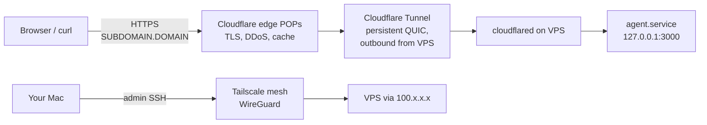

# VPS Setup Runbook

A reference for provisioning a Hetzner VPS for the personal AI agent. Pairs with `spec.md` (architecture) and tracks Step 3 of the build order.

The whole point: the public internet has exactly **one way in** (Cloudflare Tunnel), and you have exactly **one way to admin** (Tailscale). Both are revocable from a single dashboard if either is compromised.

---

## Architecture



The VPS has two addresses:

- **Public IP** (e.g. `87.99.131.241`) — exists, but `ufw` drops every inbound packet that isn't on the `tailscale0` interface. No port is open to the public internet.
- **Tailnet IP** (e.g. `100.87.162.111`) — only devices on your tailnet can reach it. This is how you SSH and administer the box.

Cloudflare reaches your app **without ever touching the public IP**. `cloudflared` opens persistent outbound QUIC connections to Cloudflare's edge; CF then routes inbound HTTPS traffic for `agent.<domain>` back through that tunnel.

---

## Mental model — what each piece does and why

| Component         | Job                                                                                  | Why this and not something else                                                                       |
| ----------------- | ------------------------------------------------------------------------------------ | ----------------------------------------------------------------------------------------------------- |
| **Hetzner VPS**   | The actual computer running the agent                                                | Cheap (~€4/mo), good price/perf, has US locations                                                     |
| **Tailscale**     | Private mesh network for admin SSH                                                   | Mesh VPN, zero-config. **Use APT, not Snap** — Snap's sandbox blocks `tailscale ssh`                  |
| **ufw**           | Default-deny firewall                                                                | Defense in depth. Even if Tailscale broke, no public inbound is possible                              |
| **`agent` user**  | Dedicated unprivileged Linux user that runs the app                                  | If the app is ever compromised, attacker has `agent` perms, not root                                  |
| **systemd**       | Starts the app on boot, restarts on crash                                            | Native to Ubuntu, no extra daemon. `EnvironmentFile` directive keeps secrets out of the unit file     |
| **`EnvironmentFile`** | Loads secrets at service start                                                   | Keeps `ANTHROPIC_API_KEY` out of the unit file. `chmod 600` = only owner can read                     |
| **PostgreSQL 17** | Database for threads, messages, memory                                               | Step 2 of the spec needs it. PG17 is current LTS in 2026. Spec says PG16; PG17 is fine                |
| **Node 24**       | Runtime for the agent code                                                           | Current LTS as of April 2026                                                                          |
| **cloudflared**   | Public ingress without opening any ports on the VPS                                  | Box dials *out* to Cloudflare. Public URL → CF edge → tunnel → localhost service                      |

---

## Order of operations (and why this exact order)

Security-first. Each step assumes the previous is solid.

1. **Provision** — Hetzner's Ubuntu image is key-only SSH on first boot. Reasonable starting point.
2. **Lock down** — close the public attack surface *before* installing anything important.
3. **Software stack** — Node, Postgres, cloudflared. If any has a CVE, the firewall already blocks the world.
4. **App + systemd** — run on `127.0.0.1`-only port. Bugs can't be hit externally.
5. **Cloudflare Tunnel** — *now* punch the controlled door for public traffic.
6. **Reboot test** — prove everything survives a power cycle.

The opposite order is dangerous. Example: if you install Postgres before configuring the firewall, it briefly listens on `0.0.0.0` between install and configure, and you've exposed your DB.

---

## Phase A — Provision Hetzner VPS

### A.1 Generate a local SSH key (only once, ever)

```bash
ssh-keygen -t ed25519 -C "your-email" -f ~/.ssh/id_ed25519 -N ""
cat ~/.ssh/id_ed25519.pub   # copy this for Hetzner
```

`-N ""` skips the passphrase. Re-key with a passphrase later if you want extra protection on the local file.

### A.2 In Hetzner Cloud Console

1. **Security → SSH Keys → Add SSH Key** — paste the pubkey, name it (e.g. `mac-local`).
2. **Servers → Add Server**:

   | Field         | Value                                       |
   | ------------- | ------------------------------------------- |
   | Location      | **Ashburn, VA** (or your closest)           |
   | Image         | **Ubuntu 24.04**                            |
   | Type          | **CX22** (Shared vCPU, €3.79/mo)            |
   | Networking    | Default (Public IPv4 + IPv6 both on)        |
   | SSH Keys      | The key you just added                      |
   | Volumes       | None                                        |
   | Firewalls     | None (we'll use `ufw` on the box itself)    |
   | Backups       | Off (can enable later, ~20% extra)          |
   | Name          | `agent-prod`                                |

3. After "Status" turns green, copy the **Public IPv4** from the server detail page.

### A.3 Verify

```bash
ssh -o StrictHostKeyChecking=accept-new root@<PUBLIC_IP> 'whoami; uname -srm; grep -E "^(NAME|VERSION)=" /etc/os-release'
```

Expect to see `root`, kernel info, and Ubuntu 24.04.

---

## Phase B — Lock down (most dangerous if done wrong)

> **READ THIS FIRST:** the rule for this phase is *verify the new path before closing the old one*. Open a second terminal and confirm tailnet SSH works **before** enabling `ufw`.

### B.1 Patch the system

```bash
ssh root@<PUBLIC_IP>

export DEBIAN_FRONTEND=noninteractive NEEDRESTART_MODE=a
apt update && apt upgrade -y \
  -o Dpkg::Options::="--force-confdef" -o Dpkg::Options::="--force-confold"
```

### B.2 Install Tailscale (APT, **never** Snap)

```bash
curl -fsSL https://tailscale.com/install.sh | sh
tailscale up --ssh
# ↑ click the URL it prints. Sign into Tailscale with the SAME account
#   used by your other devices. Authorize the new machine.

tailscale status   # note the 100.x.x.x address — this is your tailnet IP
```

### B.3 Verify tailnet SSH from your Mac (DO NOT SKIP)

In a **new terminal on your Mac**:

```bash
ssh root@<TAILNET_IP>     # should connect successfully
```

If this fails, **stop**. Do not proceed to ufw. Debug Tailscale (see Troubleshooting). If you enable ufw without a working tailnet path, you'll lock yourself out and have to use Hetzner's web console to recover.

### B.4 Enable ufw and harden sshd

Back on the VPS (over the tailnet now):

```bash
ufw default deny incoming
ufw default allow outgoing
ufw allow in on tailscale0
ufw --force enable

# Defense in depth: turn off password auth in sshd
echo "PasswordAuthentication no" > /etc/ssh/sshd_config.d/99-hardening.conf
sshd -t && systemctl reload ssh

# Dedicated app user
useradd -r -m -d /home/agent -s /bin/bash agent
```

### B.5 Verify lockdown

From your Mac, public SSH should now time out:

```bash
ssh -o ConnectTimeout=5 root@<PUBLIC_IP>     # expect: Operation timed out
ssh root@<TAILNET_IP>                        # should still work
```

---

## Phase C — Software stack

```bash
ssh root@<TAILNET_IP>

# Node 24 LTS via NodeSource
curl -fsSL https://deb.nodesource.com/setup_24.x | bash -
apt install -y nodejs
node --version    # v24.x
npm --version

# PostgreSQL 17 via PGDG (Ubuntu 24.04 only ships PG 16 by default)
apt install -y postgresql-common
/usr/share/postgresql-common/pgdg/apt.postgresql.org.sh -y
apt install -y postgresql-17 postgresql-client-17
sudo -u postgres psql -c "SELECT version();"

# cloudflared via Cloudflare's apt repo
mkdir -p --mode=0755 /usr/share/keyrings
curl -fsSL https://pkg.cloudflare.com/cloudflare-main.gpg | tee /usr/share/keyrings/cloudflare-main.gpg >/dev/null
echo "deb [signed-by=/usr/share/keyrings/cloudflare-main.gpg] https://pkg.cloudflare.com/cloudflared any main" \
  > /etc/apt/sources.list.d/cloudflared.list
apt update && apt install -y cloudflared
cloudflared --version
```

---

## Phase D — App + systemd

> **Note (post-step-4):** The `hello.mjs` smoke-test placeholder below has been superseded by the real agent service (`apps/agent/src/server.ts`, deployed to `/opt/agent/dist/server.js`). The systemd unit shape below is still accurate; only `ExecStart`, `/opt/agent/.env`, and the file contents differ. See `project_dev_runbook.md` (memory) and `project_build_progress.md` step 4 for the current state. The original phase-D content is kept here for the provisioning-from-scratch story.

```bash
install -d -o agent -g agent -m 755 /opt/agent

# Drop your app code into /opt/agent (e.g. index.mjs)
# For a smoke test, this works:
cat > /opt/agent/hello.mjs <<'EOF'
import http from "node:http";
const port = parseInt(process.env.PORT || "3000", 10);
const msg = process.env.AGENT_MSG || "unset";
http.createServer((_req, res) => {
  res.writeHead(200, { "content-type": "text/plain" });
  res.end(`agent ok\nAGENT_MSG=${msg}\npid=${process.pid}\n`);
}).listen(port, "127.0.0.1", () => {
  console.log(`listening on http://127.0.0.1:${port} msg=${msg}`);
});
EOF
chown agent:agent /opt/agent/hello.mjs

# Secrets file — chmod 600, agent-owned. ONLY place secrets live.
cat > /opt/agent/.env <<EOF
ANTHROPIC_API_KEY=sk-ant-...
AGENT_MSG=hello-from-systemd
PORT=3000
EOF
chown agent:agent /opt/agent/.env
chmod 600 /opt/agent/.env

# systemd unit
cat > /etc/systemd/system/agent.service <<EOF
[Unit]
Description=Personal AI agent
After=network-online.target postgresql.service
Wants=network-online.target

[Service]
Type=simple
User=agent
Group=agent
WorkingDirectory=/opt/agent
EnvironmentFile=/opt/agent/.env
ExecStart=/usr/bin/node /opt/agent/hello.mjs
Restart=always
RestartSec=5
StandardOutput=journal
StandardError=journal

[Install]
WantedBy=multi-user.target
EOF

systemctl daemon-reload
systemctl enable --now agent.service     # enable=on boot, --now=start now
systemctl status agent.service --no-pager
journalctl -u agent.service -n 20
curl http://127.0.0.1:3000               # smoke test
```

---

## Phase E — Cloudflare Tunnel

Requires a domain on Cloudflare DNS (the domain's nameservers must point at Cloudflare).

### E.1 Authenticate cloudflared (interactive)

```bash
ssh root@<TAILNET_IP>
cloudflared tunnel login
# ↑ click the URL, pick the zone (your domain), Authorize.
#   cert.pem saves to /root/.cloudflared/cert.pem
```

### E.2 Create the tunnel and write config

```bash
cloudflared tunnel create agent-prod
UUID=$(cloudflared tunnel list | awk '$2 == "agent-prod" {print $1; exit}')

mkdir -p /etc/cloudflared
cp /root/.cloudflared/$UUID.json /etc/cloudflared/$UUID.json

cat > /etc/cloudflared/config.yml <<EOF
tunnel: $UUID
credentials-file: /etc/cloudflared/$UUID.json

ingress:
  - hostname: <SUBDOMAIN>.<DOMAIN>
    service: http://127.0.0.1:3000
  - service: http_status:404
EOF
```

### E.3 Auto-create DNS and install service

```bash
# Creates the CNAME automatically — DON'T do this manually in the dashboard
cloudflared tunnel route dns agent-prod <SUBDOMAIN>.<DOMAIN>

cloudflared service install
chown -R cloudflared:cloudflared /etc/cloudflared
chmod 600 /etc/cloudflared/$UUID.json
systemctl enable --now cloudflared
```

### E.4 Verify from your Mac

```bash
curl -i https://<SUBDOMAIN>.<DOMAIN>
# expect HTTP/2 200, body matches your app's response, server: cloudflare
```

---

## Phase F — Reboot test

```bash
ssh root@<TAILNET_IP> 'systemctl reboot'
# Wait ~30s

ssh root@<TAILNET_IP> '
  uptime
  for s in tailscaled postgresql ufw cloudflared agent.service; do
    printf "  %-15s %s\n" $s $(systemctl is-active $s)
  done
'
curl https://<SUBDOMAIN>.<DOMAIN>
```

All five services should be `active`. Public URL should still serve.

> **Note:** `systemctl is-active ssh` returns `inactive` on Ubuntu 24.04. That is normal — Ubuntu uses socket activation now (`ssh.socket` is the listener; `ssh@xxx.service` instances spawn per connection). Don't try to "fix" it.

---

## Mental shortcuts to remember

- **Two addresses for the box.** Public IP = firewalled. Tailnet IP = admin. You almost never use the public IP again.
- **App listens on `127.0.0.1` only.** `cloudflared` is the only thing that talks to it. World-facing port = nothing.
- **One place for secrets.** `/opt/agent/.env`, `chmod 600`, owned by `agent`. Everything else (unit files, configs) is fine in Git.
- **`enable --now`** means start on boot AND start right now. Almost always the right verb.
- **The tunnel doesn't care about ufw.** Outbound is allowed by default; `cloudflared` dials out from the box. Don't add ufw rules for it.
- **Verify before closing.** When swapping admin paths (e.g. enabling ufw), the new path must work before you close the old one.

---

## Gotchas

| # | Gotcha                                                                                                                          | Why                                                                                                       |
| - | ------------------------------------------------------------------------------------------------------------------------------- | --------------------------------------------------------------------------------------------------------- |
| 1 | Snap Tailscale won't do `tailscale ssh`                                                                                         | Snap's sandbox blocks the kernel calls. Use `tailscale.com/install.sh` (APT)                              |
| 2 | `ssh.service` is `inactive` after reboot                                                                                        | Ubuntu 24.04 uses socket activation. `ssh.socket` is the listener. Normal.                                |
| 3 | Don't manually create the CNAME in CF dashboard                                                                                 | `cloudflared tunnel route dns` knows the UUID and sets the right target + proxy flag                      |
| 4 | `cloudflared` runs as the `cloudflared` user, not `root`                                                                        | After `cloudflared service install`, `chown -R cloudflared:cloudflared /etc/cloudflared`                  |
| 5 | PG 17 needs PGDG repo                                                                                                           | Ubuntu 24.04 ships PG 16. Use `apt.postgresql.org.sh` to add the repo                                     |
| 6 | `useradd` vs `adduser`                                                                                                          | `useradd -r -m -d /home/x -s /bin/bash x` is the cleanest one-liner. `adduser --system` doesn't auto-create home |
| 7 | Hetzner ID verification can take hours                                                                                          | New accounts may need photo ID verified before you can create a server. Plan ahead.                       |
| 8 | `unattended-upgrades` may run on first boot                                                                                     | Wait for it before doing big `apt` ops, or you'll get lock errors.                                        |
| 9 | DNS propagation looks instant for CF-internal CNAMEs but apex/external can take longer                                          | If the URL doesn't work in the first second, give it 30s before debugging.                                |

---

## ⚠️ Dangerous things — DO NOT DO

| ⛔ | Why it's bad                                                                                                                       |
| - | ---------------------------------------------------------------------------------------------------------------------------------- |
| Enable `ufw` before verifying tailnet SSH works                                                       | Locks you out. Recovery requires Hetzner's web console.                                                                            |
| Run `ufw reset` without re-adding the `tailscale0` allow rule                                         | Same as above. `reset` clears all rules including the one keeping you in.                                                          |
| `rm -rf /etc/cloudflared/`                                                                            | Destroys tunnel credentials. You'll have to delete the tunnel in CF dashboard and recreate from scratch.                           |
| `tailscale logout` on the VPS                                                                         | Drops the box from your tailnet immediately. You'll lose admin access until you reauth via Hetzner's web console.                  |
| Change `sshd_config` without `sshd -t` first                                                          | A typo in sshd_config can prevent sshd from starting on next reload. Always test first.                                            |
| Delete the systemd unit file while service is running, then `daemon-reload`                           | Service is in an undefined state. Stop the service first, then remove the file.                                                    |
| Use `--no-verify` or `--force` on git pushes from the VPS                                             | You're pushing as someone with prod access. Don't bypass safety checks.                                                            |
| Put `ANTHROPIC_API_KEY` in the systemd unit file                                                      | Unit files end up in Git. Use `EnvironmentFile=` pointing at a `chmod 600` file outside the repo.                                  |
| `cloudflared tunnel delete` without re-creating                                                       | Public URL goes 530. You'll have to redo Phase E.                                                                                  |
| `systemctl mask` something instead of `disable`                                                       | `mask` makes it impossible to start (even manually). `disable` just removes the boot link.                                         |

If you screw up and lose tailnet access:

1. Hetzner Cloud Console → your server → **Console** (top-right) — gives you a web-based root shell over the hypervisor, bypassing SSH and ufw entirely.
2. From there: `ufw disable` to restore SSH, fix the issue, re-enable ufw correctly.

---

## Verification checklist

After any full setup or major change, run all six:

| # | Check                                                                                | Expected                  |
| - | ------------------------------------------------------------------------------------ | ------------------------- |
| 1 | `ssh -o ConnectTimeout=5 root@<PUBLIC_IP>`                                           | times out (firewall ✓)    |
| 2 | `ssh root@<TAILNET_IP>`                                                              | connects (tailnet ✓)      |
| 3 | `systemctl is-active tailscaled postgresql ufw cloudflared agent.service` *on the box* | all `active`            |
| 4 | `curl http://127.0.0.1:3000` *on the box*                                            | app responds              |
| 5 | `curl https://<SUBDOMAIN>.<DOMAIN>` *from anywhere*                                  | same response, via CF     |
| 6 | `systemctl reboot`, wait 30s, repeat 2–5                                             | all still pass            |

If any fail, that phase isn't really done.

---

## Troubleshooting

### Can't SSH at all (even with key)

- **Suspect:** firewall, sshd config, key mismatch.
- **Diagnose:** Hetzner Cloud Console → server → **Console** → `ufw status`, `systemctl status ssh`, `cat /var/log/auth.log | tail -30`.
- **Fix:** `ufw disable` to confirm firewall is the cause. Verify `~/.ssh/authorized_keys` for `root` (or `agent`) has your pubkey.

### Tailscale won't connect / `tailscale up` URL doesn't authenticate

- **Suspect:** wrong account, machine not authorized, ACL blocking.
- **Diagnose:** check the URL — it shows the destination tailnet. Make sure it matches the account on your Mac.
- **Fix:** in [login.tailscale.com/admin/machines](https://login.tailscale.com/admin/machines) approve the new device. If the device shows up in the wrong tailnet, `tailscale logout` on the VPS and re-run `tailscale up --ssh` with the right account.

### `tailscale status` shows the VPS as `offline` from your Mac

- **Suspect:** Tailscale.app on Mac not running, or VPS lost connection.
- **Fix:** restart Tailscale.app on Mac. On VPS: `systemctl restart tailscaled`.

### ufw locked me out

- **Recovery:** Hetzner Cloud Console → server → **Console** (web shell). `ufw disable`. Then fix rules and re-enable.
- **Prevention:** before `ufw enable`, always have a second terminal SSH'd in via tailnet to confirm that path works.

### `cloudflared.service` won't start (`permission denied` reading credentials)

- **Suspect:** `cloudflared` user can't read `/etc/cloudflared/<UUID>.json`.
- **Diagnose:** `journalctl -u cloudflared -n 30` — look for permission errors. `ls -la /etc/cloudflared/`.
- **Fix:** `chown -R cloudflared:cloudflared /etc/cloudflared && chmod 600 /etc/cloudflared/<UUID>.json && systemctl restart cloudflared`.

### Public URL returns Cloudflare error 530 (DNS resolution failed)

- **Suspect:** tunnel not connected, DNS pointing somewhere else, or cloudflared down.
- **Diagnose:** `systemctl status cloudflared`, `journalctl -u cloudflared -n 30`. In CF dashboard, check the DNS record for the subdomain — should be a CNAME to `<UUID>.cfargotunnel.com` with proxy enabled (orange cloud).
- **Fix:** restart `cloudflared`. If DNS is wrong, `cloudflared tunnel route dns agent-prod <SUBDOMAIN>.<DOMAIN>` to recreate.

### Public URL returns Cloudflare error 502 (bad gateway)

- **Suspect:** tunnel is up but the upstream service isn't responding on `127.0.0.1:3000`.
- **Diagnose:** on the box, `curl -v http://127.0.0.1:3000`. If that fails, `systemctl status agent.service`. Check the port in `config.yml` matches the port your app listens on.
- **Fix:** start/restart `agent.service`. Check `journalctl -u agent.service` for app errors. Verify the `PORT` in `/opt/agent/.env` matches the ingress in `/etc/cloudflared/config.yml`.

### Public URL returns Cloudflare error 1033 (Argo tunnel error)

- **Suspect:** ingress rule mismatch — request hostname doesn't match any rule, fell through to the catch-all.
- **Diagnose:** `cat /etc/cloudflared/config.yml`. The `hostname:` should exactly match what you typed in the URL (no trailing dot).
- **Fix:** edit the `hostname:` line, `systemctl restart cloudflared`.

### `agent.service` keeps restarting

- **Suspect:** app crashes on startup, missing env var, port already in use.
- **Diagnose:** `journalctl -u agent.service -n 50`. Look at the startup error.
- **Fix:** common causes: missing `ANTHROPIC_API_KEY` in `/opt/agent/.env`, syntax error in app code, port collision.

### Postgres won't start

- **Suspect:** disk full, port in use, corrupted cluster.
- **Diagnose:** `systemctl status postgresql`, `journalctl -u postgresql -n 30`, `df -h`.
- **Fix:** if disk-full, free space. If port collision, check what else is on 5432 (`ss -tlnp | grep 5432`).

### After reboot, a service shows `inactive`

- **Suspect:** missing `enable` (only ran `start`).
- **Diagnose:** `systemctl is-enabled <service>`.
- **Fix:** `systemctl enable <service>`.

---

## Useful commands reference

```bash
# Service management
systemctl status <svc>            # current state
systemctl is-active <svc>         # one-line answer
systemctl is-enabled <svc>        # will it start on boot?
systemctl restart <svc>
systemctl enable --now <svc>      # enable on boot AND start now
journalctl -u <svc> -n 50         # last 50 log lines
journalctl -u <svc> -f            # tail (follow) live logs
journalctl -u <svc> --since "1h ago"

# Tailscale
tailscale status                  # see all devices on tailnet
tailscale ip                      # this box's tailnet IP
tailscale up --ssh                # re-authenticate / re-enable Tailscale SSH
tailscale set --ssh=true          # turn on Tailscale SSH without re-auth

# ufw
ufw status verbose                # current rules
ufw allow in on tailscale0        # idempotent — safe to re-run
ufw disable                       # for emergency recovery from console
ufw --force enable                # skip the "are you sure" prompt

# cloudflared
cloudflared tunnel list                                          # show tunnels
cloudflared tunnel info agent-prod                               # tunnel details + connections
cloudflared tunnel route dns agent-prod <SUBDOMAIN>.<DOMAIN>     # (re)create CNAME
cloudflared tunnel delete agent-prod                             # destroy (after stopping service)

# Postgres
sudo -u postgres psql                          # interactive shell as postgres user
sudo -u postgres psql -c "SELECT version();"   # one-shot query
systemctl status postgresql

# Disk + memory
df -h                                          # disk usage
free -h                                        # RAM
top                                            # processes (or htop if installed)
```

---

## Replacing or destroying parts

### Swap the placeholder for the real agent

1. Drop new code at `/opt/agent/index.mjs` (or wherever).
2. Edit `/opt/agent/.env` — add real secrets.
3. Edit `/etc/systemd/system/agent.service` — update `ExecStart` if needed.
4. `systemctl daemon-reload && systemctl restart agent.service`.
5. `journalctl -u agent.service -f` to watch.
6. Verify with `curl http://127.0.0.1:3000` then `curl https://<SUBDOMAIN>.<DOMAIN>`.

The tunnel keeps pointing at `127.0.0.1:3000` — no DNS or CF changes needed.

### Tear down the tunnel cleanly

```bash
systemctl disable --now cloudflared
cloudflared tunnel delete agent-prod
# Manually delete the CNAME in CF DNS dashboard (CLI doesn't auto-clean it)
```

### Destroy and start over

1. Hetzner Cloud Console → server → Delete.
2. Cloudflare Zero Trust → Networks → Tunnels → delete `agent-prod`.
3. Cloudflare DNS → delete the `<SUBDOMAIN>` record.
4. Tailscale admin → Machines → remove `agent-prod`.
5. Local Mac: remove the host key entry (`ssh-keygen -R <PUBLIC_IP>` and `ssh-keygen -R <TAILNET_IP>`).
6. Start at Phase A.

---

## Costs (April 2026)

| Item                       | Cost                  |
| -------------------------- | --------------------- |
| Hetzner CX22, Ashburn      | €3.79/mo (~$4)        |
| Cloudflare Tunnel          | Free                  |
| Cloudflare DNS             | Free (with any plan)  |
| Tailscale (personal)       | Free (up to 100 devs) |
| Anthropic API              | Pay-as-you-go         |

Total fixed infra: **~$4/month**. The big variable is API usage.
